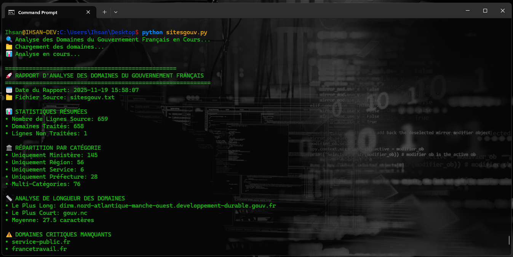

# 🥖 FR-Gouv-Domains-Analyzer

**Outil d'Analyse Avancée des Domaines du Gouvernement Français**

🔍 *Analyse complète des domaines .gouv.fr*

Features:

    🎯 Détection exhaustive des domaines gouvernementaux français

    📈 Analyses statistiques avancées par ministère/région

    🔍 Monitoring de disponibilité en temps réel

    📊 Rapports automatisés avec visualisations

    🗃️ Base de données des sites .gouv.fr

**Domaines Supportés:**

 - .gouv.fr - Sites gouvernementaux principaux

 - .pref.gouv.fr - Préfectures et administrations locales

 - .gouv.nc - Nouvelle-Calédonie

 - .gouv.pf - Polynésie française

 ---

**Happy Coding! 💻**

*Made with ❤️ by [Ihsan Sencan](https://github.com/ihsansencan)*

⭐ **Star this repo if you find it useful!** ⭐

